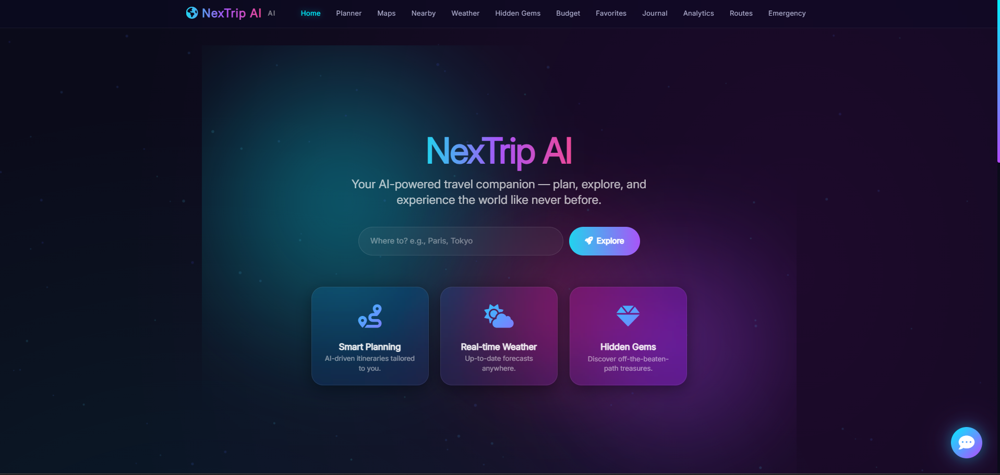
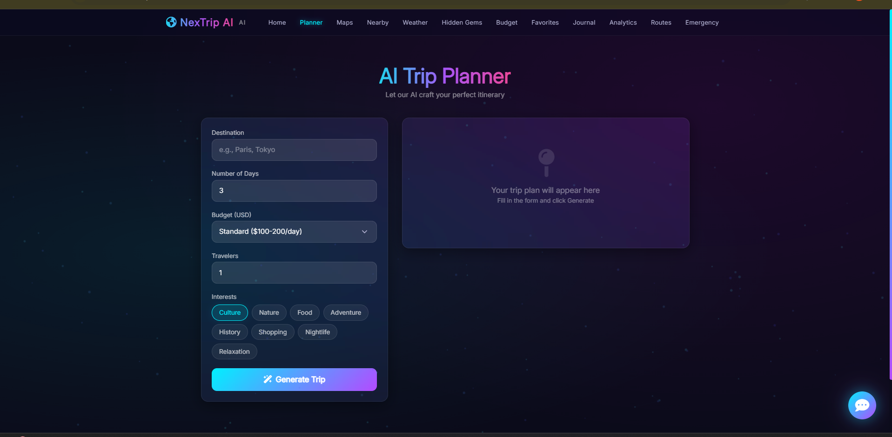
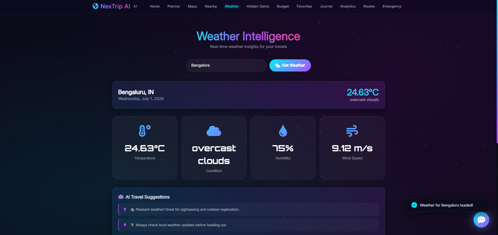
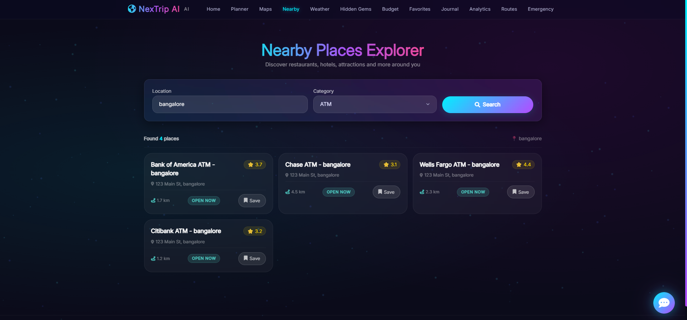
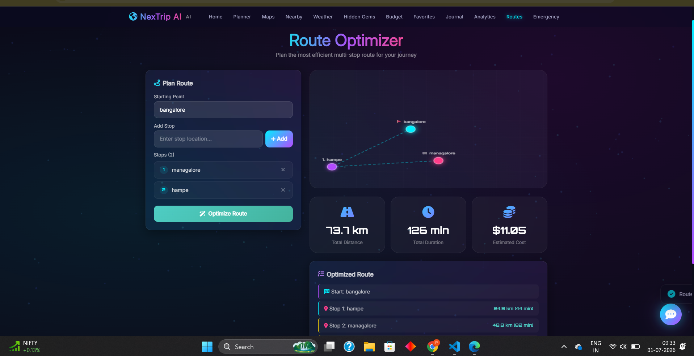

# 🌍 NexTrip AI

<p align="center">
  <b>AI-Powered Travel Planning Platform</b><br>
  Smart Travel Planning • Real-Time Weather • Route Optimization • Hidden Gems Discovery
</p>

---

## 🚀 Overview

NexTrip AI is a modern AI-powered travel assistant that helps travelers plan smarter trips with personalized itineraries, weather forecasting, nearby attractions, route optimization, and intelligent travel recommendations.

The platform combines Generative AI with travel utilities to provide an all-in-one travel planning experience.

---

## ✨ Key Features

### 🤖 AI Trip Planner
- Personalized travel itineraries
- Day-wise trip planning
- Budget-conscious recommendations
- AI-generated travel suggestions

### 🌦️ Weather Forecasting
- Real-time weather information
- Temperature and humidity tracking
- City-based weather search

### 📍 Nearby Places Explorer
- Discover nearby attractions
- Tourist spots recommendations
- Local points of interest

### 🛣️ Route Optimization
- Travel route planning
- Efficient destination navigation
- Optimized travel paths

### 💎 Hidden Gems Discovery
- Explore unique locations
- Offbeat destination suggestions
- Local experiences

### 💰 Budget Planner
- Travel cost estimation
- Budget management
- Expense planning

### 📊 Travel Analytics
- Travel insights
- Planning statistics
- Smart travel reports

### 📝 Travel Journal
- Save travel memories
- AI-assisted travel notes

---

## 🛠️ Technology Stack

### Frontend
- HTML5
- CSS3
- JavaScript

### Backend
- Python
- Flask

### APIs & AI
- Google Gemini AI
- OpenWeather API
- Google Maps API
- Google Places API

### Development Tools
- VS Code
- Git
- GitHub
- Python Dotenv

---

## 📸 Project Screenshots

### 🏠 Home Page



---

### 🤖 AI Trip Planner



---

### 🌦️ Weather Dashboard



---

### 📍 Nearby Places



---

### 🛣️ Route Optimizer



---

## 📂 Project Structure

```text
NexTrip-AI
│
├── app.py
├── requirements.txt
├── README.md
├── .env.example
│
├── screenshots
│   ├── 01_homepage1.png
│   ├── 02_plannerpage.png
│   ├── 03_weatherpage.png
│   ├── 04_nearbypage.png
│   └── 05_routepage.png
│
├── static
│   ├── css
│   └── js
│
└── templates
```

## ⚙️ Installation

### Clone Repository

```bash
git clone https://github.com/praveenjoe115/NexTrip-AI.git
cd NexTrip-AI
```

### Create Virtual Environment

```bash
python -m venv venv
```

### Activate Environment

```bash
venv\Scripts\activate
```

### Install Dependencies

```bash
pip install -r requirements.txt
```

### Configure Environment Variables

Create a `.env` file:

```env
GEMINI_API_KEY=your_gemini_api_key
OPENWEATHER_API_KEY=your_openweather_api_key
GOOGLE_MAPS_API_KEY=your_google_maps_api_key
GOOGLE_PLACES_API_KEY=your_google_places_api_key
```

### Run Project

```bash
python app.py
```

---

## 🎯 Future Enhancements

- User Authentication
- Trip History Management
- PDF Export
- Voice-Based Travel Assistant
- Multi-Language Support
- Hotel & Flight Integration
- Travel Expense Tracker

---

## 👨‍💻 Developer

### Praveen Kumar U

BCA Graduate | AI & Software Development Enthusiast

**GitHub:**  
https://github.com/praveenjoe115

**LinkedIn:**  
https://www.linkedin.com/in/praveen-kumar-0a731a417

---

## ⭐ Highlights

✅ AI-Powered Travel Planner  
✅ Real-Time Weather Forecasting  
✅ Nearby Attractions Discovery  
✅ Route Optimization  
✅ Modern Responsive UI  
✅ Flask Backend Architecture  
✅ API Integration  
✅ Generative AI Integration  

---

### If you found this project useful, consider giving it a ⭐ on GitHub.